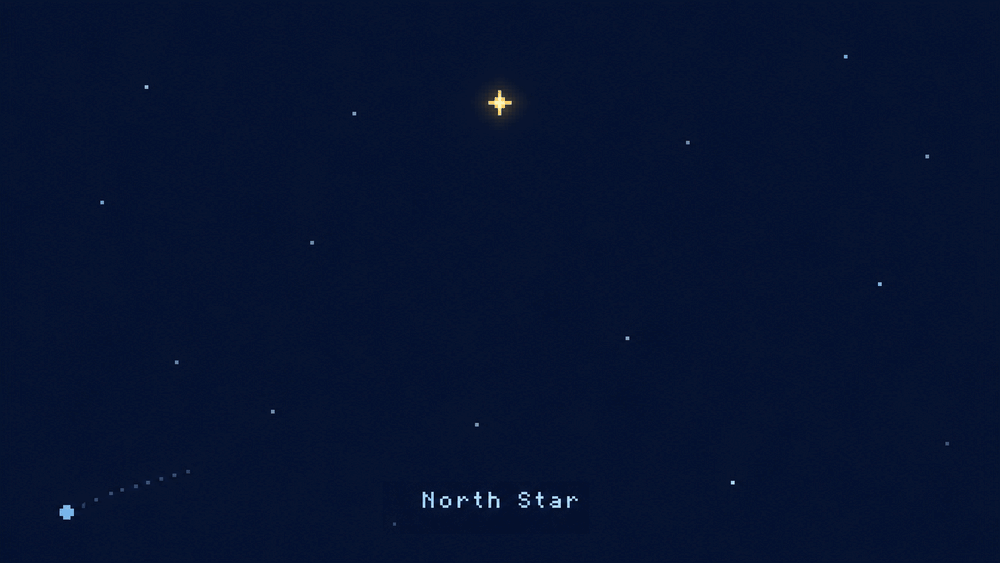
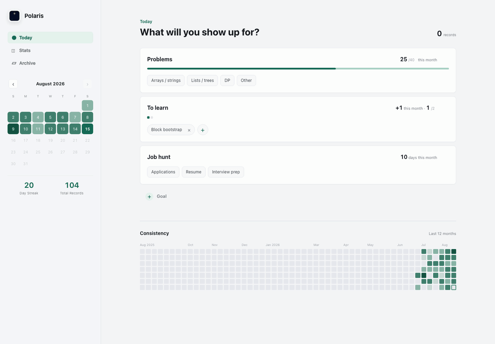
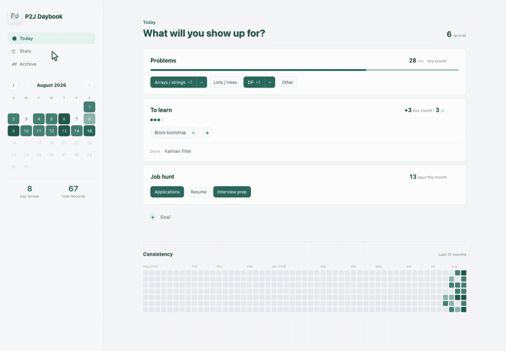
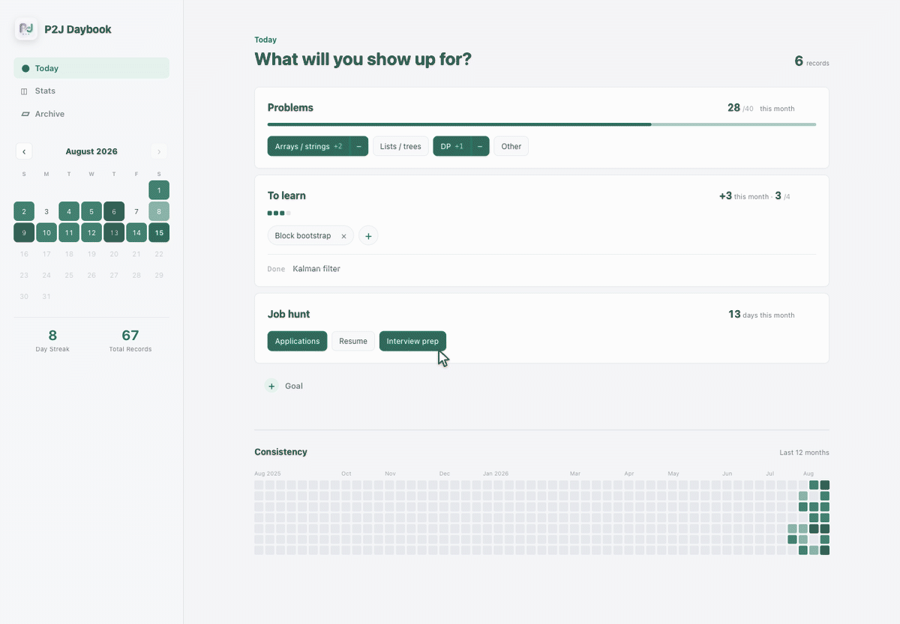

# Polaris



Polaris is a local check-in app for tracking a few goals and whether you showed
up for them each day.

Polaris is the north star: the fixed point you steer by. The app holds up to seven
goals — few enough to stay in view — and records whether you showed up for each one,
day by day. The goals are the star; the daily check-ins are the climb toward it.

## Download

<!-- x-release-please-start-version -->
| Version | Platform | Architecture | Download |
| --- | --- | --- | --- |
| v0.4.0 | macOS | Apple Silicon (arm64) | [DMG installer](https://github.com/skang10/polaris/releases/latest/download/Daybook_aarch64.dmg) |
<!-- x-release-please-end -->

The installer and the app bundle are still named `Daybook`; only the name shown in the
app has changed so far.

This build is not notarized. If macOS blocks it the first time, right-click **Daybook**
and choose **Open**.

## App Preview

### Daily check-ins

Tap a sub-goal to record it. Counters, the monthly progress bar, and the
consistency heatmap update as you go.



### Notes on the way to done

List goals carry a markdown note per item. Write as you learn, then mark the
item complete — it moves to Done and keeps the note.


### Stats

The Stats tab reviews the month: records per goal, active days, a category
mix, and everything completed — each with its note a click away.



### Every day is kept

Any past day opens from the calendar as a read-only snapshot, including the
notes exactly as they were completed that day.



## Development

### Requirements

- Rust 1.77 or newer
- Tauri CLI 2
- macOS with Xcode command line tools for the tested build path

```bash
xcode-select --install
cargo install tauri-cli --version "^2"
```

### Build

```bash
git clone https://github.com/skang10/polaris
cd polaris/src-tauri
cargo tauri build
```

That leaves you in `src-tauri`. The app bundle and the installer are written below it:

```text
target/release/bundle/macos/Daybook.app
target/release/bundle/dmg/Daybook_<version>_aarch64.dmg
```

The `.dmg` is named for the architecture it was built on.

The bundle is still called `Daybook`. Its identifier, `com.skang10.daybook`, is what
macOS uses to locate an install's check-in data, so renaming it would strand the
records of anyone already running the app. That rename needs a migration, not a
search and replace.

### Icons

All icons derive from `docs/icon.png`. To rebuild them after changing that file:

```bash
scripts/build-icns.sh
```

Do not run `cargo tauri icon` on its own. The `.icns` is assembled by hand so the
16pt and 32pt slices can carry simplified art — at those sizes the dotted trail
resolves to noise, so they show an enlarged star instead. `cargo tauri icon`
overwrites the `.icns` with single-art slices and that detail is lost silently.
`scripts/build-icns.sh` runs it in the right order and rebuilds the `.icns` after.

### Test

Frontend logic is covered by a lightweight Node harness that loads `src/app.js`
in a minimal DOM environment. Run it from the repository root:

```bash
cd ..
node tests/test.js
```

### Local data

Daybook stores data in one local JSON file and makes no network requests.

```text
~/Library/Application Support/com.skang10.daybook/checkin.json
```

The folder name is the Tauri bundle identifier, from `src-tauri/tauri.conf.json`. Change
it and the app looks in a new, empty directory — move the file across at the same time,
or the old one is orphaned.

The file is plain indented JSON. There is currently no export button, so back it up with
normal file tools such as `cp`.
